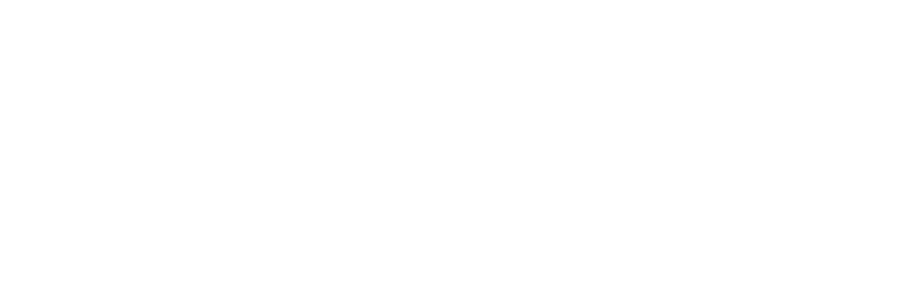

<!DOCTYPE html>
<html lang="es">
<head>
  <meta charset="UTF-8" />
  <meta name="viewport" content="width=device-width, initial-scale=1.0" />
  <title>Yongolailan - Web Under Construction</title>
  <!-- Agregando Google Fonts para una tipografía más moderna -->
  <link rel="preconnect" href="https://fonts.googleapis.com">
  <link rel="preconnect" href="https://fonts.gstatic.com" crossorigin>
  <link href="https://fonts.googleapis.com/css2?family=Montserrat:wght@400;700&display=swap" rel="stylesheet">
  
</head>
<body>
  <!-- Contenedor del fondo animado -->
  

  <!-- Contenedor del logo y mensaje -->
  

    
    <h1>WEB UNDER CONSTRUCTION</h1>
    <a href="https://linktr.ee/Yongolailan" target="_blank">Yongolailan's Link Tree</a>
  

  <!-- Dependencias necesarias para Vanta.js -->
  
  
  
</body>
</html>

